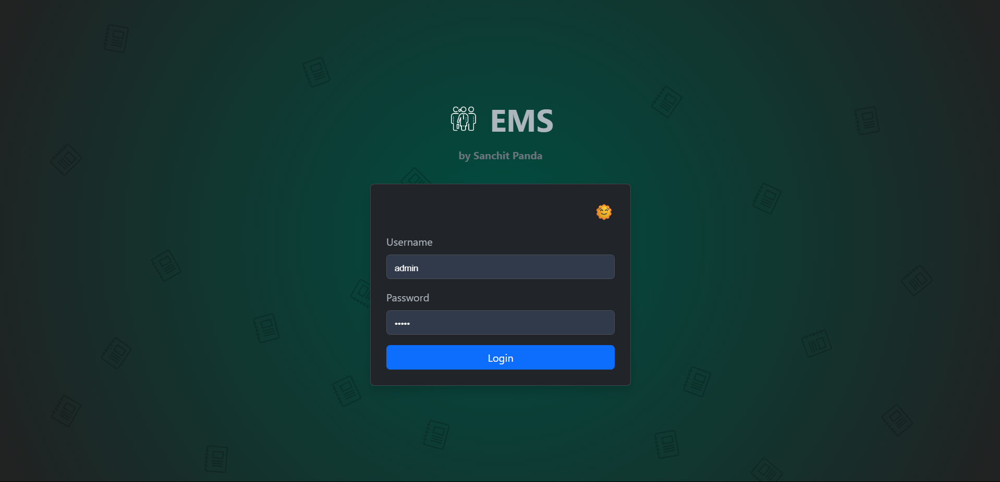
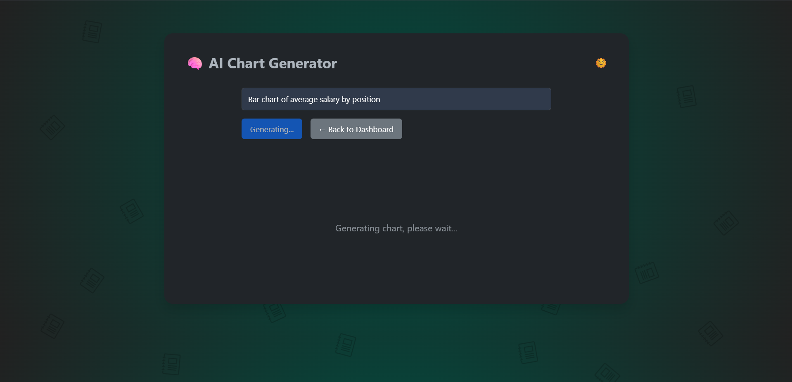
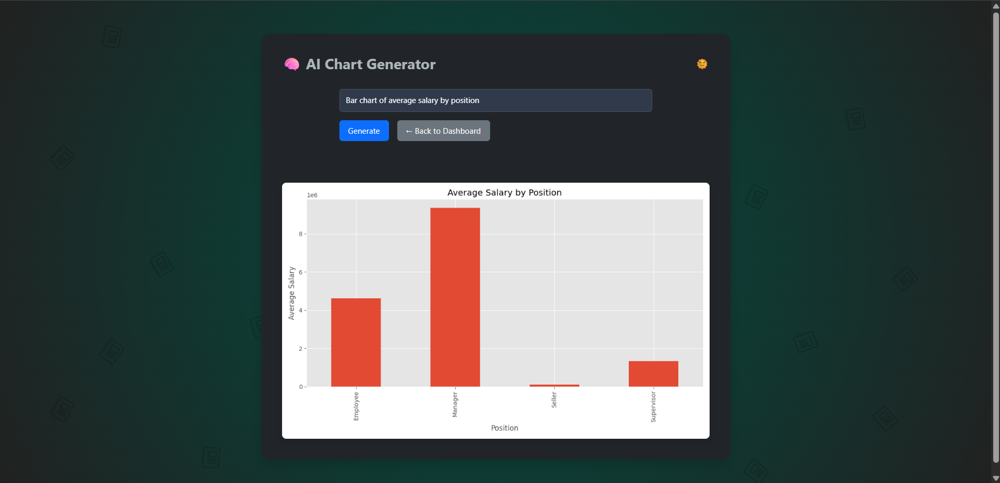
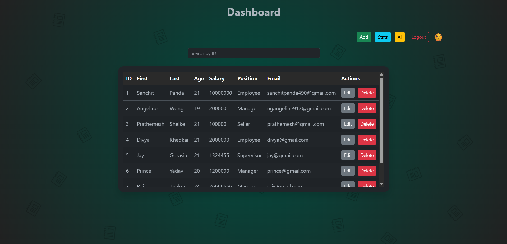
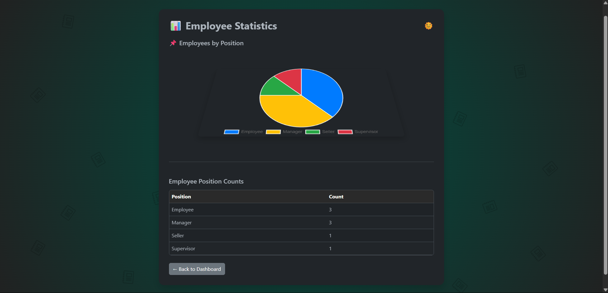
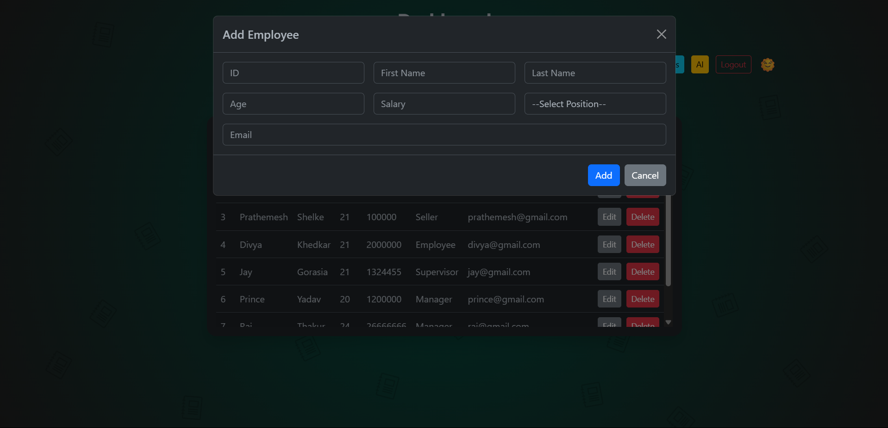
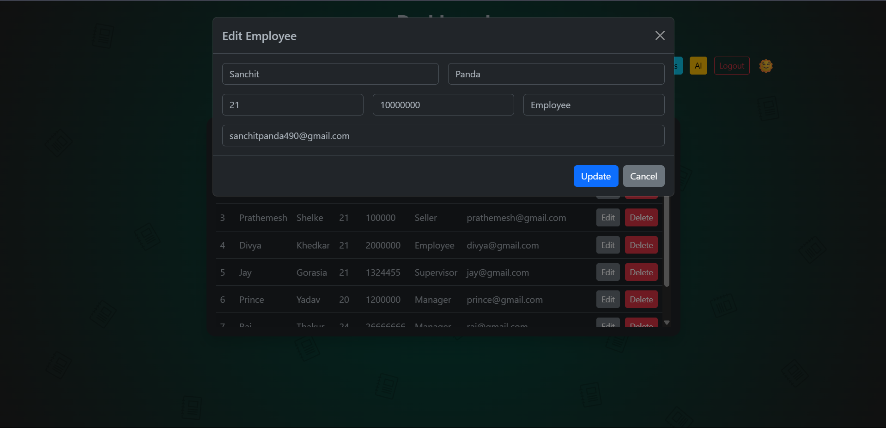

# 👨‍💼 Employee Management System (EMS) with AI Chart Generation

This Flask-based web application provides a comprehensive Employee Management System with CRUD (Create, Read, Update, Delete) functionalities, employee statistics, and an innovative **AI-powered Chart Generator**. The AI Chart Generator leverages OpenAI's large language models to transform natural language prompts into visual data representations based on your employee data.

---

## 🚀 Deployment

- Click on the link to visit the deployed app: [App]()

---

## ✅ Features

### 🧑‍💼 Employee Management
- **CRUD Operations**: Add, view, edit, and delete employee records.  
- **Employee List**: Browse all employees with key details.  
- **Employee Statistics**: View aggregated data and default charts (e.g., Employees by Position).  
- **Email Sending**: Send emails to employees directly from the system.  
- **User Authentication**: Secure login/logout functionality.  

### 📊 AI Chart Generator
- **Natural Language to Chart**: Generate custom data visualizations by simply typing a prompt (e.g., "Bar chart of average salary by position").  
- **Data-Driven Insights**: Charts are generated based on your actual employee data.  
- **Dynamic Plotting**: Utilizes Matplotlib and Pandas to create various chart types.  
- **Seamless Integration**: Generated charts are displayed directly within the web interface.  

---

## 🧰 Tech Stack

- **Frontend**: HTML, CSS (Bootstrap), JavaScript  
- **Backend**: Python, Flask  
- **Database**: SQLite (local file-based for simplicity)  
- **AI/LLM**: OpenAI (for natural language processing and code generation)  
- **Data Analysis & Plotting**: Pandas, Matplotlib  
- **Environment Management**: `python-dotenv`  

---

## 📦 Installation & Setup

### 1. Clone the Repository

```bash
git clone https://github.com/your-username/ems-ai-chart-generator.git
cd ems-ai-chart-generator
```

> Replace `your-username` with your actual GitHub username.

### 2. Create and Activate a Virtual Environment

#### Windows
```bash
python -m venv venv
venv\Scripts\activate
```

#### macOS / Linux
```bash
python3 -m venv venv
source venv/bin/activate
```

### 3. Install Dependencies

Create a `requirements.txt` file with the following content:

```
Flask
python-dotenv
openai
pandas
matplotlib
requests
```

Then run:

```bash
pip install -r requirements.txt
```

### 4. Configure Environment Variables

Create a `.env` file in the root directory with:

```
OPENAI_API_KEY='your_openai_api_key_here'
```

> Replace `'your_openai_api_key_here'` with your actual OpenAI API key.

---

## 🖼️ Screenshots
| Login Page | 
|---------|-----------|
|  

| AI Input | AI Output |
|---------|-----------|
|  |  |

| Dashboard | Employee Stats |
|-----------|----------------|
|  |  |

| Add Employees | Edit Employees |
|-----------|----------------|
|  |  

---

## 📁 File Structure

```
├── app.py                  # Main Flask application
├── templates/
│   ├── login.html          # Login page
│   ├── dashboard.html      # Employee dashboard
│   ├── employee_form.html  # Add/Edit employee form
│   ├── stats.html          # Employee statistics page
│   └── ai.html             # AI Chart Generator interface
├── services/
│   ├── insights.py
│   ├── auth.py             # User authentication logic
│   ├── db.py               # Database (SQLite) operations
│   ├── insights.py         # AI Chart generation logic (OpenAI integration)
├── .env                    # Environment variables (e.g., OpenAI API Key)
├── requirements.txt        # Python dependencies
├── README.md               # Project documentation
├── screenshots/            # Directory for screenshots
│   ├── 1.png
│   ├── 2.png
│   ├── 3.png
│   └── 4.png
└── employee_database.db    # SQLite database file (created on first run)
```

---

## ▶️ Running the App

### Initialize the Database (First Run Only)

The `initialize_db()` function in `services/db.py` will automatically create `employee_database.db` and necessary tables if they don’t exist.

### Start the Flask Application

```bash
python app.py
```

Then open your browser at: [http://localhost:5000](http://localhost:5000)

---

## 💡 Example Usage

1. **Access Login Page**: Go to [http://localhost:5000](http://localhost:5000)  
2. **Login**: Use default credentials (as set in `services/auth.py`)  
3. **Navigate to Dashboard**  
4. **Manage Employees**: Add, edit, delete employee records  
5. **View Stats**: Click "Stats" for charts  
6. **AI Charts**:
   - Go to "AI" page
   - Enter prompt like:  
     `"Pie chart of employees by position"`  
     `"Bar chart of average salary by department"`  
   - Click "Generate"
   - See the chart appear below

---

## ⚙️ How It Works

### Backend (Flask)

- Handles web routes, form submissions, API endpoints
- Integrates with SQLite for persistent employee storage
- Generates and serves AI-generated charts using OpenAI + Matplotlib

### Database (SQLite)

- Stores employee details
- Queried to extract data for charts/statistics

### AI Chart Generation (`services/insights.py`)

- Extracts all employee data
- Sends it with your prompt to OpenAI GPT-4
- GPT returns Python code (Pandas + Matplotlib)
- Flask executes this securely, captures chart as PNG
- Encodes PNG to Base64 and sends it to the frontend

### Frontend (HTML/JS)

- Accepts prompt input
- Sends AJAX POST to `/insight`
- Receives Base64 PNG and shows chart inline

---

## 📚 Dependencies

- `Flask`: Web framework  
- `python-dotenv`: Environment variable support  
- `openai`: OpenAI API SDK  
- `pandas`: Data handling  
- `matplotlib`: Chart plotting  
- `requests`: For email features

Install all with:

```bash
pip install -r requirements.txt
```

---

## 🧯 Troubleshooting

- **ModuleNotFoundError**: Run `pip install -r requirements.txt`  
- **API Key Errors**: Ensure your `.env` has the correct key and permissions  
- **Chart Not Showing**:  
  - Check console for traceback  
  - Ensure your prompt is clear and data supports the chart  
  - Verify `get_all_employees()` returns valid data  
- **Port Conflict**:  
  - Change in `app.py` → `app.run(debug=True, port=5001)`

---

## 🔗 Resources

- [Flask Documentation](https://flask.palletsprojects.com/)  
- [OpenAI API Docs](https://platform.openai.com/docs)  
- [Pandas Docs](https://pandas.pydata.org/docs/)  
- [Matplotlib Docs](https://matplotlib.org/stable/contents.html)  
- [Bootstrap Docs](https://getbootstrap.com/docs/)
